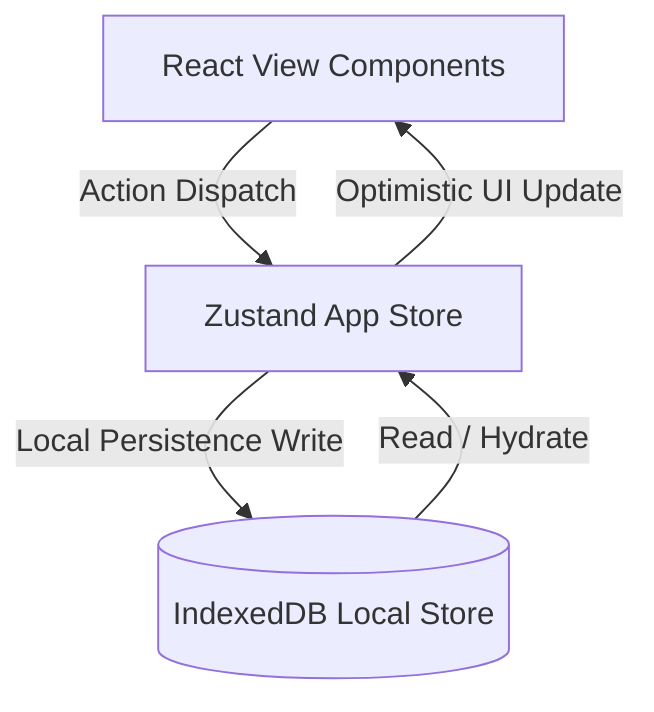

<div align="center">

<br/>

# ◼ MONO

### A Local-First Personal Operating System

**One place. Every workflow.**

<br/>

[](https://github.com/siddhantbhatia220/MONO)
[](https://nextjs.org)
[](https://typescriptlang.org)
[](LICENSE)
[](CONTRIBUTING.md)

<br/>

</div>

---

## What is MONO?

MONO is not a to-do app.

It is a **high-performance, local-first Personal Operating System** — a single, adaptive workspace where tasks, notes, goals, events, and projects live together without forcing a rigid workflow on you.

Instead of adapting to the software, the software adapts to you.

**Everything is an Item.** A task, a note, a goal, a bookmark, a habit — all inherit from the same universal model. Infinite views. One source of truth.

---

## Architecture & Data Flow

MONO is architected with a local-first, offline-capable database layer backed by Zustand state management and IndexedDB.



### Core Architecture Decoupling:
1. **Zustand State Store**: Synchronizes runtime components. State updates are optimistic to deliver sub-50ms user action response times.
2. **IndexedDB Layer**: Direct asynchronous background writing via the `idb` wrapper. Guarantees complete data persistence without network reliance.
3. **Universal Item Model**: A unified model design where every data block has an `itemType` (task, note, goal) and a dynamic tag list.

---

## Design Philosophy

- **Pure monochrome** — black, white, and grayscale only. Timeless.
- **Keyboard-first** — every action accessible via `⌘K` / `Ctrl+K` command palette
- **Local-first** — instant launch, works offline, syncs later
- **Invisible UI** — the interface disappears so you can focus on your work
- **Composable** — build your workflow from modular, reusable primitives

---

## Features — Phase 1

- ✅ **Onboarding & Cinematic Intro** — beautiful first-run experience featuring spring logo reveals, moving ambient portal backdrops, and an interactive looping simulated tour of MONO.
- ✅ **Universal Command Palette** — `Ctrl+K` / `⌘K` launcher to quickly create items, switch workspaces, filter views, or toggle settings.
- ✅ **Quick Capture** — `N` key focuses input instantly. Supports inline `#tag` extraction and `!priority` parsing.
- ✅ **Offline-First Storage** — Full IndexedDB wrapper logic, allowing 100% operation in offline mode.
- ✅ **Animated UI** — Fluid transitions and interactive bobs built using Framer Motion springs.
- ✅ **Workspace Management** — Easily segment your life into dedicated templates (Work, Study, Personal, Custom).
- ✅ **Light & Dark Mode** — Native system preference tracking with custom theme toggles.
- ✅ **Keyboard Shortcuts Overlay** — Global listeners mapped throughout the interface with a toggleable guide (`?`).
- ✅ **TypeScript Strict** — Fully compiled type definitions, zero `any` usage.

---

## Getting Started

### Prerequisites
- Node.js ≥ 18
- npm ≥ 9

### Installation

```bash
git clone https://github.com/siddhantbhatia220/MONO.git
cd MONO
npm install
cp .env.example .env.local
npm run dev
```

Open [http://localhost:3000](http://localhost:3000) in your browser.

---

## Keyboard Shortcuts

| Shortcut | Action |
|---|---|
| `Ctrl+K` / `⌘K` | Open Command Palette |
| `N` | New item (focuses quick capture) |
| `?` | Show keyboard shortcuts overlay |
| `Ctrl+B` | Toggle collapsible sidebar |
| `Escape` | Close modals / cancel inputs |
| `Enter` | Complete selection / open item |

---

## Folder Structure

```
src/
├── app/                 # Next.js App Router (pages and root layouts)
├── components/
│   ├── ui/              # Atom-level primitives (Button, Checkbox, Input, Modal, Badge)
│   ├── layout/          # App chrome structure (Sidebar, CommandPalette, ThemeProvider)
│   ├── items/           # Item interactions (ItemRow, QuickCapture, ItemDetailPanel)
│   └── views/           # High-level layouts (ListView, EmptyState)
├── lib/
│   ├── db/              # IndexedDB operations (items, workspaces CRUD)
│   ├── hooks/           # Responsive hooks (useIsMobile, etc.)
│   ├── store/           # Zustand store instances (appStore, uiStore, itemStore)
│   ├── types/           # Rigid TypeScript types
│   └── utils/           # Helper scripts (dates, ids, keyboards)
└── styles/
    └── tokens.css       # Monochrome custom CSS design tokens
```

---

## FAQ

#### Q: Why is MONO strictly monochrome?
A: Color is often used as a crutch in modern software, causing visual distraction. By limiting MONO to pure monochrome (black, white, and grayscales), we create a high-contrast environment where visual hierarchy is driven by typography, weight, and size.

#### Q: Where is my data stored?
A: In Phase 1, 100% of your data remains locally on your device in IndexedDB. No remote servers are contacted, guaranteeing absolute privacy and instantaneous offline usability.

#### Q: Why Zustand instead of Redux or React Context?
A: Zustand offers a highly performant, boilerplate-free state model. It supports selectors to prevent unnecessary component re-renders, combines easily with IndexedDB callbacks, and offers persistent middleware options.

---

## Contributing

See [CONTRIBUTING.md](CONTRIBUTING.md) for contribution guidelines.

## Security

See [SECURITY.md](SECURITY.md) for the security policy.

## License

MIT © [Siddhant Bhatia](https://github.com/siddhantbhatia220)
