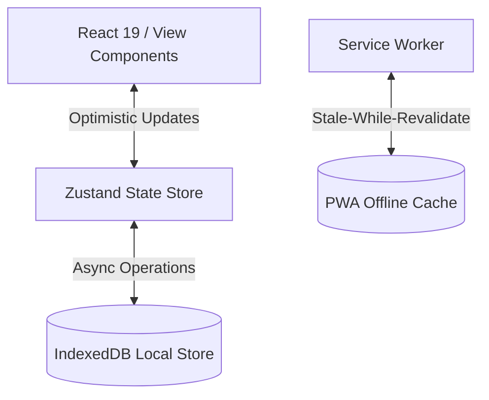

<div align="center">

# MONO

### Local-First Personal Operating System & Workspace

*A privacy-focused, keyboard-first workspace unifying tasks, notes, projects, and goals.*

[](https://nextjs.org)
[](https://typescriptlang.org)
[](https://tailwindcss.com)
[](https://web.dev/progressive-web-apps/)
[](LICENSE)

</div>

---

## Overview

**MONO** is an open-source, local-first Personal Operating System engineered for speed, privacy, and focus. Built around a **Universal Item Model**, MONO eliminates arbitrary silos between tasks, notes, goals, bookmarks, and events — allowing all data to coexist in a single source of truth.

- **100% Local-First**: All data is persisted directly in IndexedDB. Zero cloud latency and instant offline functionality.
- **PWA Enabled**: Installable on Desktop, iOS, and Android with Service Worker offline caching.
- **Universal Views**: Toggle seamlessly between List, Kanban Board, Calendar, and Timeline views over identical data.
- **Keyboard-Driven**: Instant access to every action via `Ctrl+K` / `⌘K` Command Palette and global hotkeys.
- **Monochrome Aesthetics**: A distraction-free, 10-stop monochrome visual design system built with Framer Motion spring physics.

---

## Architecture & Local-First Data Flow


```mermaid
graph TD
    UI[React 19 / View Components] <-->|Optimistic Updates| Store[Zustand State Store]
    Store <-->|Async Operations| IDB[(IndexedDB Local Store)]
    SW[Service Worker] <-->|Stale-While-Revalidate| Cache[(PWA Offline Cache)]
```

### Architecture Highlights

- **Optimistic State Management**: Zustand handles client-side state with sub-50ms render response times.
- **IndexedDB Storage**: Direct client storage wrapper (`idb`) guarantees complete data ownership on device.
- **Service Worker Caching**: PWA service worker pre-caches core application routes and static assets for sub-second startup.

---

## Core Features

- ⚡ **Natural Language Quick Capture**: Focus with `N`. Parse inline tags (`#work`), priority (`!high`), and dates (`@tomorrow`) automatically.
- 📱 **Mobile & Touch Ergonomics**: Responsive slide-over drawer, mobile bottom sheet detail panel, and touch-friendly Kanban card actions.
- 📋 **Multi-View System**:
  - **List View**: Rapid task management with status filters.
  - **Board View**: Interactive Kanban columns with mobile quick-move options.
  - **Calendar View**: Date-gridded scheduling and milestone tracking.
  - **Timeline View**: Visual gantt-style project scheduling.
- 🔍 **Fuzzy Search & Filters**: Universal query engine and smart tag filter bar.
- 📲 **Native PWA Support**: Installable application with offline fallback and standalone app window integration.
- 🤖 **Automated Engineering Journal**: Integrated Python automated daily commit and logging script (`scripts/daily_commit.py`).

---

## Quick Start

### Prerequisites

- **Node.js**: `^18.0.0` or `>=20.0.0`
- **npm**: `>= 9.0.0`

### Local Development Setup

1. **Clone the repository**:
   ```bash
   git clone https://github.com/siddhantbhatia220/MONO.git
   cd MONO
   ```

2. **Install dependencies**:
   ```bash
   npm install
   ```

3. **Start the development server**:
   ```bash
   npm run dev
   ```

4. Open [http://localhost:3000](http://localhost:3000) in your browser.

---

## Available Scripts

| Script | Description |
| --- | --- |
| `npm run dev` | Starts Next.js Turbopack development server |
| `npm run build` | Builds optimized production bundle |
| `npm run start` | Runs Next.js production server |
| `npm run type-check` | Executes strict TypeScript compilation check |
| `npm run lint` | Runs ESLint static analysis |
| `npm run format` | Formats codebase with Prettier |
| `npm run format:check` | Verifies code style compliance for CI |

---

## Keyboard Shortcuts

| Shortcut | Action |
| --- | --- |
| `Ctrl+K` / `⌘K` | Universal Command Palette |
| `N` | Quick Capture focus |
| `Ctrl+B` / `⌘B` | Toggle Collapsible Sidebar |
| `?` | Keyboard Shortcuts Guide |
| `Escape` | Close active modal / panel |

---

## Project Structure

```
MONO/
├── .github/              # GitHub Actions workflows (CI, Daily Commit)
├── public/               # Static PWA assets, manifest.json, sw.js, and icons
├── scripts/              # Python daily commit automation script
└── src/
    ├── app/              # Next.js 16 App Router pages and manifest
    ├── components/
    │   ├── items/        # Item components (QuickCapture, ItemRow, ItemDetailPanel)
    │   ├── layout/       # App shell chrome (Sidebar, MobileDrawer, CommandPalette)
    │   ├── ui/           # Atomic design primitives (Button, Checkbox, Modal, Input)
    │   └── views/        # Workspace views (ListView, BoardView, CalendarView, TimelineView)
    ├── lib/
    │   ├── db/           # IndexedDB persistence layer
    │   ├── hooks/        # Custom React hooks (usePWA, useIsMobile)
    │   ├── search/       # Fuzzy search engine
    │   └── store/        # Zustand stores (appStore, itemStore, uiStore)
    └── styles/
        └── tokens.css    # Monochrome CSS design tokens
```

---

## License

Distributed under the MIT License. See [LICENSE](LICENSE) for details.

Developed by [Siddhant Bhatia](https://github.com/siddhantbhatia220).
